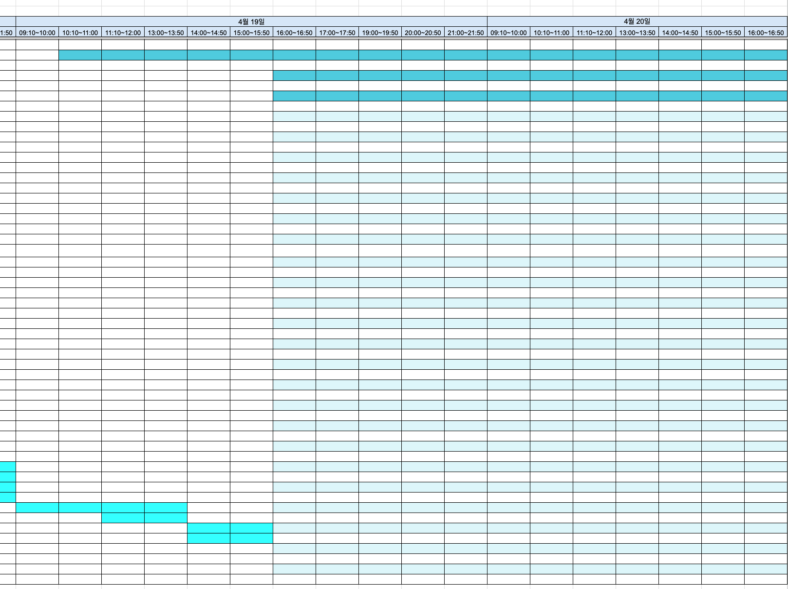
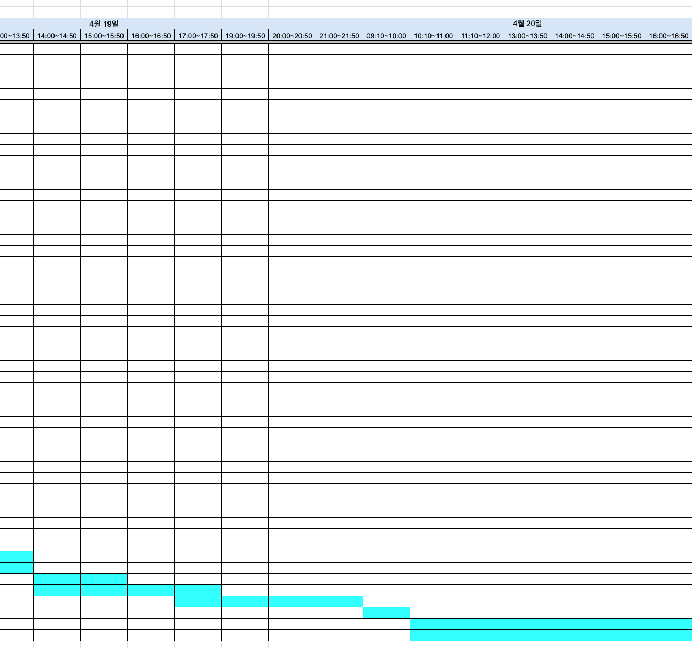

# clear-spreadsheet

This tool is for the case where you never intentionally applied a theme, only colored the white cells you needed, and then got surprised when Google Sheets suddenly showed extra background colors or stripes after opening the file.

It is especially useful for `.xlsx` files where manually colored cells carry meaning, such as schedules, work trackers, or study plans that need to be shared with other people.

## Usage

```bash
./setup.sh
./run.sh /path/to/file.xlsx
```

You can also run it directly without the virtualenv wrapper.

```bash
python3 clear_spreadsheet.py /path/to/file.xlsx
```

By default, the tool creates `filename.cleaned.xlsx` in the same directory as the input file.

Example:

```bash
./run.sh ~/Downloads/your_file.xlsx
```

Output:

```text
Done.
Output file: /Users/you/Downloads/your_file.cleaned.xlsx
Removed theme/table artifacts: 6 parts, 4 table links, 8 theme color refs
```

If you want to install it as a local package instead of using `run.sh`, `setuptools` is used through `pyproject.toml`.

## Before and After

### Before

Google Sheets reinterprets the hidden `theme` and `table style`, so background colors or stripes reappear on top of the cell colors you originally applied by hand.



### After

Only the explicit cell colors remain, while the striped table background and theme-based background are removed.



## Why this happens

An `.xlsx` file can contain an extra styling layer beyond the visible cell fill colors.

- Colors you apply manually are stored in the cell `fill`.
- Excel table banding is stored through `tableStyle` and `tableParts`.
- Some default colors are stored as `theme` indexes instead of concrete RGB values.
- Google Sheets can reinterpret that hidden style information and reapply background styling that is less noticeable in Excel.

So the problem is not that the cell colors were saved incorrectly. The real issue is that hidden table/theme styling can come back in a different viewer.

## What this tool does

- Converts `theme` color references into explicit `rgb` values
- Removes Excel `table` definitions and `table style`
- Removes banding driven by `showRowStripes` / `showColumnStripes`
- Removes Google Sheets round-trip metadata

## What it tries to preserve

- Explicit cell background colors
- Cell values
- Merged cells
- Column widths / row heights
- Most worksheet / drawing structure

## Options

Set the output filename explicitly:

```bash
python3 clear_spreadsheet.py input.xlsx --output output.xlsx
```

Change the default suffix:

```bash
python3 clear_spreadsheet.py input.xlsx --suffix fixed
```

Overwrite the original file in place:

```bash
python3 clear_spreadsheet.py input.xlsx --in-place
```

Overwrite an existing output file:

```bash
python3 clear_spreadsheet.py input.xlsx --overwrite
```

## Limitations

- Only `.xlsx` is supported right now.
- If a workbook relies heavily on theme-colored charts or shapes, it is still worth checking the result visually once.

## License

MIT

## Test

```bash
python3 -m unittest discover -s tests
```
