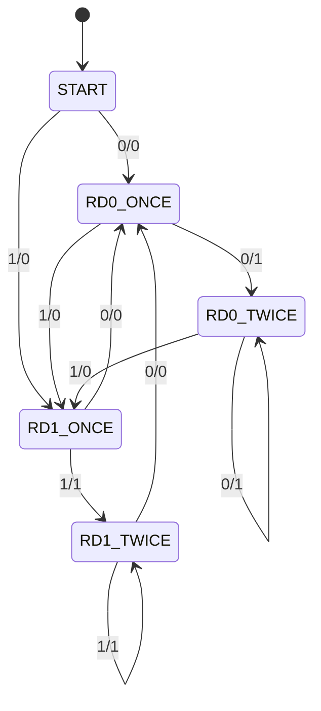

# CHAPTER 11 순차회로 모델링

```table-of-contents
```

> Verilog HDL 교재 장별 강의 노트  
> 작성 기준: 교재 목차 + 수업 메모 + 공개 참고 자료 재구성

## 이 장의 핵심

- 순차회로는 현재 입력뿐 아니라 이전 상태를 함께 사용한다.
- D 래치는 level-sensitive 저장소이고, 플립플롭은 edge-triggered 저장소라는 차이가 중요하다.
- 기본 문장은 `always @(posedge clk ...)`이며, 상태 갱신에는 `<=`를 쓰는 습관이 중요하다.
- 카운터, 레지스터, 시프트 레지스터, LFSR, FSM은 순차회로의 대표 예다.
- 리셋, clock enable, setup/hold, metastability 감각이 실제 하드웨어와 맞닿아 있다.

## 세부 목차

1. 순차회로의 정의
2. D 래치
3. 플립플롭 기반 모델링
4. 계수기와 시프트 레지스터
5. FSM
6. 타이밍 주의점

## 한 줄 요약

11장은 "기억하는 회로"를 코드로 쓰는 장이다. 클럭, 상태, 리셋, 논블로킹 할당을 함께 이해해야 비로소 순차 설계가 안정적으로 잡힌다.

## 현재 수업과 연결

- Day 3~5의 `counter_4`, `clk divider`, `tick_counter`
- Day 5의 latch / flip-flop / setup / hold / metastability / CDC
- Day 6의 `fsm_led`
- Day 7의 `Moore -> Mealy` 비교와 연속 `0`/`1` 검출기

이 전부가 이 장의 실습 확장판이다.

## 1. 순차회로란 무엇인가

순차회로는 현재 입력만 보지 않는다. 이전 상태도 함께 사용한다.

- 플립플롭이나 레지스터 같은 기억소자가 있다.
- 보통 클럭 엣지를 기준으로 상태가 갱신된다.
- "지금 무엇을 저장하고 있는가"를 함께 봐야 한다.

### 형식만 먼저 보기

```text
next_state = f(current_state, input)
current_state <= next_state at clock edge
```

### 1.1 D 래치와 플립플롭의 출발점

11장을 시작할 때 먼저 구분해야 하는 것은 `latch`와 `flip-flop`이다.

- `D latch`는 enable 신호의 레벨에 반응한다.
- `D flip-flop`은 클럭의 엣지에 반응한다.
- 둘 다 값을 저장하지만, 입력을 받아들이는 타이밍이 다르다.

즉 래치는 "문이 열려 있는 동안 따라가는 저장소", 플립플롭은 "문이 닫혀 있다가 특정 순간에만 샘플링하는 저장소"로 이해하면 된다.

### 1.2 D 래치

`D latch`는 level-sensitive 저장소다.

- `en = 1`이면 출력 `q`가 입력 `d`를 따라간다.
- `en = 0`이면 마지막 값을 유지한다.

### 문법만 먼저 보기

```verilog
always @(*) begin
    if (en)
        q = d;
end
```

### 예제

```verilog
module d_latch (
    input  en,
    input  d,
    output reg q
);
    always @(*) begin
        if (en)
            q = d;
    end
endmodule
```

### 해석

- `en`이 활성화되어 있는 동안 `q`는 `d`를 그대로 따라간다.
- `en`이 비활성화되면 이전 값을 유지해야 하므로 저장 기능이 생긴다.
- 이 때문에 조합회로에서는 같은 코드 패턴이 "원치 않는 래치 추론"이 되지만, 여기서는 의도적으로 만든 저장소다.

### 왜 먼저 배우는가

- 나중에 조합회로에서 왜 불완전한 `if`, `case`가 위험한지 이해하려면 래치 동작을 먼저 알아야 한다.
- 수업에서 말하는 `원치 않는 래치`는 사실상 D 래치가 의도치 않게 합성되는 상황이다.
- 따라서 `D latch`는 순차회로의 가장 단순한 저장 개념을 보여주는 출발점이다.

### 1.3 래치가 포함된 순차회로에서 `blocking`과 `nonblocking`

강의에서는 래치가 포함된 저장 회로에서 `blocking` 할당문(`=`)과 `nonblocking` 할당문(`<=`)이 어떻게 다르게 보이는지도 같이 비교한다.

핵심은 한 `always` 블록 안에 여러 저장 대상이 있을 때, 뒤에 오는 문장이 앞 문장의 "새 값"을 보느냐, "이전 값"을 보느냐가 달라진다는 점이다.

### `blocking` 할당문 예제

```verilog
module latch_chain_blocking (
    input  en,
    input  d,
    output reg q1,
    output reg q2
);
    always @(*) begin
        if (en) begin
            q1 = d;
            q2 = q1;
        end
    end
endmodule
```

### `nonblocking` 할당문 예제

```verilog
module latch_chain_nonblocking (
    input  en,
    input  d,
    output reg q1,
    output reg q2
);
    always @(*) begin
        if (en) begin
            q1 <= d;
            q2 <= q1;
        end
    end
endmodule
```

### 해석

- `blocking`에서는 `q1 = d`가 먼저 즉시 반영되고, 다음 줄 `q2 = q1`은 이미 바뀐 `q1`을 본다.
- 그래서 `en = 1`인 동안 `q1`, `q2`가 거의 동시에 `d`를 따라가는 형태로 읽힌다.
- `nonblocking`에서는 두 대입이 같은 시점 예약으로 처리되므로, `q2 <= q1`은 이전 `q1` 값을 본다.
- 그래서 `q2`는 `q1`보다 한 단계 늦게 따라가는 구조처럼 보인다.

즉 `=`와 `<=`의 차이는 단순 문법 차이가 아니라, 같은 블록 안에서 값이 전파되는 순서를 바꾼다.

### 강의식 정리

- 래치나 플립플롭처럼 저장소가 여러 단계 연결될 때, `blocking`을 쓰면 시뮬레이션에서 값이 한 번에 흘러가 보일 수 있다.
- `nonblocking`을 쓰면 각 저장소가 "이전 상태"를 기준으로 갱신되는 감각이 더 잘 드러난다.
- 일반적인 RTL 스타일 규칙은 조합회로 `always @(*)`에는 `blocking`, 엣지 기반 순차회로 `always @(posedge clk ...)`에는 `nonblocking`이다.
- 래치 예제는 두 할당문의 차이를 설명하기에는 좋지만, 실무 RTL에서는 의도한 저장 의미가 코드에 더 분명히 드러나도록 작성하는 것이 중요하다.

## 2. D 플립플롭 모델

`D flip-flop`은 edge-triggered 저장소다.

- `D latch`가 enable 레벨 동안 입력을 따라간다면
- `D flip-flop`은 클럭의 특정 엣지 순간에만 입력 `d`를 샘플링해서 출력 `q`에 저장한다.

그래서 순차회로에서 가장 자주 보게 되는 저장 기본소자는 보통 `D flip-flop`이다.

### D 래치와의 차이

- `D latch`: level-sensitive
  enable이 열려 있는 동안 입력을 계속 반영
- `D flip-flop`: edge-triggered
  상승엣지 또는 하강엣지 같은 특정 순간에만 값 저장

즉 래치는 "열려 있는 동안 통과", 플립플롭은 "순간 샘플링 후 유지"로 이해하면 된다.

### 문법만 먼저 보기

```verilog
always @(posedge clk or posedge rst) begin
    if (rst)
        q <= 0;
    else
        q <= d;
end
```

### 예제

```verilog
module dff (
    input  clk,
    input  rst,
    input  d,
    output reg q
);
    always @(posedge clk or posedge rst) begin
        if (rst)
            q <= 1'b0;
        else
            q <= d;
    end
endmodule
```

### 해석

- 상승 엣지에서만 갱신된다.
- `rst`가 올라오면 즉시 초기화되는 비동기 리셋 예다.
- 순차회로 기본 틀은 거의 이 형태의 변형이다.

### 읽는 포인트

- `clk`가 `0`에서 `1`로 바뀌는 순간에만 `d`를 읽는다.
- 그 외 구간에서는 입력 `d`가 흔들려도 `q`는 그대로 유지된다.
- 따라서 파형을 볼 때는 "엣지 사이 값"보다 "엣지 순간에 무엇이 샘플링됐는가"를 보는 습관이 중요하다.

### 강의식 정리

- 조합회로는 입력이 바뀌면 바로 출력이 바뀐다.
- D 래치는 enable이 열린 동안 입력을 따라간다.
- D 플립플롭은 클럭 엣지에서만 값을 받아 저장한다.

그래서 실제 동기식 디지털 설계의 기본 저장 단위는 대체로 `D flip-flop`이라고 보면 된다.

## 3. 계수기와 시프트 레지스터

순차회로 입문에서 가장 중요한 예제 중 하나다.

### 문법만 먼저 보기

```verilog
always @(posedge clk or posedge rst) begin
    if (rst)
        q <= 0;
    else
        q <= q + 1'b1;
end
```

### 예제

```verilog
module counter_4 (
    input        clk,
    input        rst,
    output reg [1:0] q
);
    always @(posedge clk or posedge rst) begin
        if (rst)
            q <= 2'b00;
        else
            q <= q + 1'b1;
    end
endmodule
```

### 해석

- 현재 값 `q`를 기억하고 있다가 다음 클럭에서 증가시킨다.
- Day 3의 digit select 생성, Day 4~5의 tick counter와 직접 연결된다.

### 3.1 시프트 레지스터

시프트 레지스터(`shift register`)는 저장된 비트를 클럭마다 한 칸씩 이동시키는 순차회로다.

- serial 입력을 한 비트씩 밀어 넣는다.
- 이전에 저장된 비트는 옆 칸으로 이동한다.
- delay line, serial-to-parallel 변환, 패턴 저장 등에 자주 쓰인다.

### 문법만 먼저 보기

```verilog
always @(posedge clk or posedge rst) begin
    if (rst)
        q <= 4'b0000;
    else
        q <= {q[2:0], din};
end
```

### 예제

```verilog
module shift_reg_4 (
    input        clk,
    input        rst,
    input        din,
    output reg [3:0] q
);
    always @(posedge clk or posedge rst) begin
        if (rst)
            q <= 4'b0000;
        else
            q <= {q[2:0], din};
    end
endmodule
```

### 해석

- 클럭이 들어올 때마다 기존 비트가 이동하고 새 입력 `din`이 한쪽 끝으로 들어온다.
- 카운터가 "값을 증가"시키는 저장 회로라면, 시프트 레지스터는 "비트를 이동"시키는 저장 회로다.
- 둘 다 클럭 엣지에서 상태가 갱신된다는 점에서는 같은 순차회로다.

### 직렬입력-직렬출력(`SISO`) 8비트 시프트 레지스터 예제

강의에서는 가장 기본적인 형태로 `직렬입력-직렬출력`, 즉 `SISO` 8비트 시프트 레지스터도 같이 본다.

```verilog
module siso_shift_reg_8 (
    input        clk,
    input        rst,
    input        sin,
    output       sout
);
    reg [7:0] q;

    always @(posedge clk or posedge rst) begin
        if (rst)
            q <= 8'b0000_0000;
        else
            q <= {q[6:0], sin};
    end

    assign sout = q[7];
endmodule
```

### 해석

- `sin`은 serial input이다.
- 클럭이 들어올 때마다 기존 데이터가 한 칸씩 이동하고, 새 비트 `sin`이 맨 끝으로 들어간다.
- `sout`은 serial output으로, 가장 앞쪽 비트가 바깥으로 빠져나간다고 보면 된다.
- 즉 한 비트씩 받아서 내부 8비트 저장소를 통과시킨 뒤, 다시 한 비트씩 내보내는 구조다.

수업에서 말한 `직렬입력-직렬출력 시프트 레지스터`는 이 `SISO` 구조를 뜻한다고 보면 된다.

### 3.2 시프트 레지스터의 종류

강의에서 나오는 `PISO`는 시프트 레지스터의 입출력 형태를 나타내는 약어다. 보통 아래 네 가지를 같이 본다.

| 약어 | 뜻 | 설명 |
| --- | --- | --- |
| `SISO` | Serial-In Serial-Out | 직렬 입력, 직렬 출력 |
| `SIPO` | Serial-In Parallel-Out | 직렬 입력, 병렬 출력 |
| `PISO` | Parallel-In Serial-Out | 병렬 입력, 직렬 출력 |
| `PIPO` | Parallel-In Parallel-Out | 병렬 입력, 병렬 출력 |

핵심은 데이터를 한 비트씩 넣고 빼는지(`serial`), 여러 비트를 한꺼번에 넣고 빼는지(`parallel`)다.

### `PISO` 감각

`PISO`는 여러 비트를 한 번에 적재(`load`)한 뒤, 클럭마다 한 비트씩 직렬로 내보내는 구조다.

- 처음에는 병렬 데이터 `pdata[3:0]`를 한 번에 저장
- 그 다음부터는 시프트하면서 맨 앞 비트를 serial output으로 전달

즉 `parallel-to-serial conversion`이 필요한 상황에서 자주 쓴다.

### `PISO` 예제

```verilog
module piso_shift_reg_4 (
    input        clk,
    input        rst,
    input        load,
    input  [3:0] pdata,
    output       sout
);
    reg [3:0] q;

    always @(posedge clk or posedge rst) begin
        if (rst)
            q <= 4'b0000;
        else if (load)
            q <= pdata;
        else
            q <= {q[2:0], 1'b0};
    end

    assign sout = q[3];
endmodule
```

### 해석

- `load = 1`이면 병렬 입력 `pdata`를 한 번에 저장한다.
- `load = 0`이면 클럭마다 한 칸씩 이동하면서 serial output `sout`으로 한 비트씩 내보낸다.
- 이 구조를 보면 왜 이름이 `Parallel-In Serial-Out`인지 바로 이해할 수 있다.

수업에서 `PISO`라는 말을 들었다면, 보통 "병렬 데이터를 받아서 직렬로 내보내는 시프트 레지스터"를 뜻한다고 기억하면 된다.

### 3.3 선형 귀환 시프트 레지스터(`LFSR`)

`LFSR`(Linear Feedback Shift Register)은 시프트 레지스터의 출력 일부를 다시 입력으로 되먹임(`feedback`)하는 구조다. 이때 중간에 `XOR`를 넣어서 다음 입력 비트를 만든다.

- shift register처럼 매 클럭마다 비트가 이동한다.
- 단, 새로 들어오는 입력 비트는 외부 입력이 아니라 내부 비트들의 `XOR` 결과다.
- 그래서 카운터처럼 상태가 계속 변하면서도, 의사난수(`pseudo-random`) 같은 패턴을 만들어낼 수 있다.

즉 LFSR은 "피드백이 걸린 시프트 레지스터"라고 이해하면 된다.

### 동작 감각

```text
feedback_bit = q[tap1] ^ q[tap2] ^ ...
next_q       = {q[n-2:0], feedback_bit}
```

- 매 사이클마다 새 비트가 들어온다.
- 그 새 비트는 현재 상태 비트들 중 일부를 `XOR`한 값이다.
- 어떤 비트를 탭(`tap`)으로 고르느냐에 따라 생성되는 패턴이 달라진다.

그래서 "매 사이클 난수를 넣는다"기보다, 내부 상태에서 계산한 의사난수 비트를 매 사이클 다시 주입한다고 보는 편이 더 정확하다.

### 4비트 LFSR 예제

```verilog
module lfsr_4 (
    input        clk,
    input        rst,
    output reg [3:0] q
);
    wire feedback;

    assign feedback = q[3] ^ q[2];

    always @(posedge clk or posedge rst) begin
        if (rst)
            q <= 4'b0001;
        else
            q <= {q[2:0], feedback};
    end
endmodule
```

### 해석

- `q[3]`, `q[2]`를 탭으로 잡아 `XOR`한 값을 새 입력 비트로 사용한다.
- reset 시 초기값(seed)을 `0001`처럼 0이 아닌 값으로 두는 것이 중요하다.
- 모든 비트가 `0`이면 `XOR` 결과도 계속 `0`이어서 상태가 멈출 수 있기 때문이다.

### 탭 위치와 패턴

- 탭 위치를 어떻게 잡느냐에 따라 상태 순환 패턴이 달라진다.
- 어떤 탭 조합은 긴 주기의 의사난수열을 만들고
- 어떤 조합은 짧은 패턴만 반복할 수 있다.

즉 LFSR은 "아무 XOR이나 넣으면 되는 회로"가 아니라, 원하는 주기와 패턴을 위해 탭 선택이 중요하다.

### 어디에 쓰는가

강의에서 강조한 대표 용도는 다음과 같다.

- 계수기 대체 구조 또는 의사난수 발생기
- 시스템 IC의 내장형 자기진단 `BIST` 회로
  테스트 벡터 생성과 테스트 응답 분석에 사용
- 데이터 압축
- 데이터 무결성 검사합
- 디지털 시스템의 다양한 pseudo-random 패턴 생성

특히 `BIST`에서는 LFSR이 테스트 패턴을 만들고, 출력 응답을 signature처럼 압축하는 데도 연결될 수 있다.

### 강의식 정리

- `LFSR = shift register + XOR feedback`
- 매 클럭마다 내부 상태가 바뀌며 의사난수 패턴을 만든다.
- 탭 위치에 따라 패턴과 주기가 달라진다.
- 단순 카운터와 달리 pseudo-random sequence가 필요할 때 매우 유용하다.

## 4. clock enable과 제어 입력

실전 카운터는 단순 증가만 하지 않는다.

### 문법만 먼저 보기

```verilog
if (rst)
    ...
else if (enable)
    ...
```

### 예제

```verilog
module counter_enable (
    input        clk,
    input        rst,
    input        en,
    output reg [3:0] q
);
    always @(posedge clk or posedge rst) begin
        if (rst)
            q <= 4'd0;
        else if (en)
            q <= q + 1'b1;
    end
endmodule
```

### 해석

- enable이 있을 때만 상태를 갱신한다.
- Day 5의 `run/stop`, `clear`, `up/down` 제어 흐름과 연결된다.

## 5. FSM 모델링

순차회로에서 상태 개념을 가장 분명하게 보여 주는 구조다.

### 문법만 먼저 보기

```verilog
always @(posedge clk or posedge rst) begin
    if (rst)
        current_state <= IDLE;
    else
        current_state <= next_state;
end

always @(*) begin
    next_state = current_state;
    case (current_state)
        ...
    endcase
end
```

### 예제

```verilog
module simple_fsm (
    input        clk,
    input        rst,
    input        in,
    output reg   out
);
    localparam S0 = 1'b0,
               S1 = 1'b1;

    reg current_state, next_state;

    always @(posedge clk or posedge rst) begin
        if (rst)
            current_state <= S0;
        else
            current_state <= next_state;
    end

    always @(*) begin
        next_state = current_state;
        out = 1'b0;

        case (current_state)
            S0: begin
                if (in) next_state = S1;
            end
            S1: begin
                out = 1'b1;
                if (!in) next_state = S0;
            end
        endcase
    end
endmodule
```

### 해석

- 상태 저장 블록과 next-state 조합 블록을 분리했다.
- `fsm_led`도 같은 사고방식으로 읽으면 된다.
- 순차와 조합이 한 회로 안에서 어떻게 협력하는지가 잘 보인다.

### 5.1 Moore와 Mealy

FSM은 보통 `Moore`와 `Mealy` 두 관점으로 설명한다.

### 문법만 먼저 보기

Moore 감각:

```text
output = f(current_state)
next_state = g(current_state, input)
```

Mealy 감각:

```text
output = f(current_state, input)
next_state = g(current_state, input)
```

### 비교표

| 구분 | Moore | Mealy |
| --- | --- | --- |
| 출력 결정 기준 | 현재 상태만 사용 | 현재 상태 + 입력 사용 |
| 출력 위치 감각 | 상태에 붙음 | 천이에 붙음 |
| 출력 반응 | 상태가 바뀐 뒤 반영 | 입력 조건이 맞으면 바로 결정 가능 |
| 실전 느낌 | 파형이 안정적이고 해석이 쉬움 | 상태/로직을 약간 줄이기 쉬움 |

### 해석

- `Moore`는 "이 상태이면 이 출력"처럼 읽는다.
- `Mealy`는 "이 상태에서 이 입력이 들어오면 이 출력"처럼 읽는다.
- 설계 뼈대는 비슷하지만, 출력을 어디에서 결정하느냐가 다르다.
- 시험에서는 둘을 분명히 구분해야 하고, 실무에서는 섞여 보이는 경우도 많다.

### 5.2 상태도에서 출력 읽기

상태도 화살표에 적힌 `0/0`, `1/1` 같은 표기는 보통 `입력 / 출력`을 의미한다.

### 형식만 먼저 보기

```text
input / output
```

### 해석

- `B -- 1/0 --> C`는 "현재 상태가 `B`이고 입력이 `1`이면 `C`로 가고 출력은 `0`"이라는 뜻이다.
- `Mealy` 상태도는 이런 식으로 화살표에 출력이 같이 붙는다.
- 자기 자신으로 돌아가는 화살표는 같은 상태를 유지하는 `self-loop`다.

### 5.3 연속된 0 또는 1 검출 Mealy FSM

현재 수업에서는 연속된 `0` 또는 `1`이 들어오는 상황을 검출하는 `Mealy FSM`을 설명했다.

### 상태 이름 먼저 보기

```text
START
RD0_ONCE
RD1_ONCE
RD0_TWICE
RD1_TWICE
```

### 상태 의미

- `START`: 아직 유효한 연속 패턴을 잡기 전 시작 상태
- `RD0_ONCE`: `0`을 한 번 읽은 상태
- `RD1_ONCE`: `1`을 한 번 읽은 상태
- `RD0_TWICE`: 연속된 `0`이 검출된 상태
- `RD1_TWICE`: 연속된 `1`이 검출된 상태

### 상태도 요약



### 해석

- 시작 상태에서는 첫 입력을 보고 `0` 쪽인지 `1` 쪽인지 갈라진다.
- `RD0_ONCE`에서 다시 `0`이 들어오면 연속 `0`이 검출되어 출력 `1`과 함께 `RD0_TWICE`로 간다.
- `RD1_ONCE`에서 다시 `1`이 들어오면 연속 `1`이 검출되어 출력 `1`과 함께 `RD1_TWICE`로 간다.
- `RD0_TWICE`, `RD1_TWICE`의 self-loop는 같은 값이 계속 들어오는 동안 검출 상태를 유지하는 의미다.
- 이 예제는 출력이 상태 원 안이 아니라 화살표 조건에 붙어 있으므로 `Mealy`로 읽는 것이 맞다.

### 5.4 B에서 A로 가는 예시 감각

교수님이 설명한 것처럼, 상태 천이 예시는 `B -> A` 같은 한 구간만 떼어서 봐도 차이가 분명하다.

### 형식만 먼저 보기

```text
Moore: B -- x=1 --> A
Mealy: B -- x=1 / y=1 --> A
```

### 해석

- `Moore`는 상태 `A`에 도착한 뒤 `A`의 출력을 본다.
- `Mealy`는 `B -> A`로 넘어가는 조건이 맞는 순간, 그 천이에 해당하는 출력을 같이 적는다.
- 그래서 `Mealy`는 상태도만 봐도 "이 조건에서 전이 + 출력이 함께 일어난다"는 점이 더 직접적으로 보인다.

### 5.5 코드로 옮기기

상태도는 보통 `parameter` 또는 `localparam`으로 상태를 선언하고, 상태 저장 블록과 조합 블록으로 나눠 구현한다.

### 문법만 먼저 보기

```verilog
parameter START = ...;
parameter RD0_ONCE = ...;

always @(posedge clk or posedge rst) begin
    if (rst)
        current_state <= START;
    else
        current_state <= next_state;
end

always @(*) begin
    next_state = current_state;
    detected   = 1'b0;

    case (current_state)
        ...
    endcase
end
```

### 예제 (교재 349p 코드 11-33 Mealy FSM 모델링)

```verilog
module seq_det_mealy (
    input      clk,
    input      rst,
    input      din,
    output reg detected
);

    parameter START     = 3'b000;
    parameter RD0_ONCE  = 3'b001;
    parameter RD1_ONCE  = 3'b010;
    parameter RD0_TWICE = 3'b011;
    parameter RD1_TWICE = 3'b100;

    reg [2:0] current_state;
    reg [2:0] next_state;

    always @(posedge clk or posedge rst) begin
        if (rst)
            current_state <= START;
        else
            current_state <= next_state;
    end

    always @(*) begin
        next_state = current_state;
        detected   = 1'b0;

        case (current_state)
            START: begin
                if (din == 1'b0)
                    next_state = RD0_ONCE;
                else
                    next_state = RD1_ONCE;
            end

            RD0_ONCE: begin
                if (din == 1'b0) begin
                    detected   = 1'b1;
                    next_state = RD0_TWICE;
                end else begin
                    next_state = RD1_ONCE;
                end
            end

            RD1_ONCE: begin
                if (din == 1'b1) begin
                    detected   = 1'b1;
                    next_state = RD1_TWICE;
                end else begin
                    next_state = RD0_ONCE;
                end
            end

            RD0_TWICE: begin
                if (din == 1'b0) begin
                    detected   = 1'b1;
                    next_state = RD0_TWICE;
                end else begin
                    next_state = RD1_ONCE;
                end
            end

            RD1_TWICE: begin
                if (din == 1'b1) begin
                    detected   = 1'b1;
                    next_state = RD1_TWICE;
                end else begin
                    next_state = RD0_ONCE;
                end
            end

            default: begin
                next_state = START;
                detected   = 1'b0;
            end
        endcase
    end
endmodule
```

### 해석

- 상태 저장은 `posedge clk`에서만 일어나므로 순차회로다.
- 출력 `detected`는 조합 블록 안에서 `current_state`와 `din`을 함께 보고 정해지므로 `Mealy`다.
- `detected = 1'b0` 기본값을 먼저 주고, 검출 조건에서만 `1'b1`로 바꾸는 식이 읽기 쉽다.
- 상태 이름을 길게 쓰면 상태도와 코드를 비교하기 쉬워서 수업 중 디버깅할 때도 편하다.

## 6. 리셋 방식

수업에서는 `reset`만 따로 보는 것이 아니라, `set`과 `reset`을 모두 가진 플립플롭을 기준으로 동기식 / 비동기식 제어를 함께 비교한다.

- `reset`: 보통 출력을 `0`으로 초기화
- `set`: 보통 출력을 `1`로 강제 설정
- 동기식 제어: 클럭 엣지에서만 반영
- 비동기식 제어: 클럭과 무관하게 즉시 반영

### 문법만 먼저 보기

비동기 `set/reset`:

```verilog
always @(posedge clk or posedge set or posedge rst)
```

동기 `set/reset`:

```verilog
always @(posedge clk)
```

### 해석

- 비동기 제어는 `set`, `reset`이 활성화되는 즉시 출력에 반영된다.
- 동기 제어는 `set`, `reset`도 클럭 엣지에서만 반영된다.
- 어떤 방식이 맞는지는 플랫폼과 팀 규칙에 따라 달라진다.

### 6.1 비동기 `set/reset`을 갖는 D 플립플롭

```verilog
module dff_async_set_reset (
    input  clk,
    input  set,
    input  rst,
    input  d,
    output reg q
);
    always @(posedge clk or posedge set or posedge rst) begin
        if (rst)
            q <= 1'b0;
        else if (set)
            q <= 1'b1;
        else
            q <= d;
    end
endmodule
```

### 해석

- `rst`가 올라오면 클럭과 무관하게 즉시 `q <= 0`
- `set`이 올라오면 클럭과 무관하게 즉시 `q <= 1`
- 둘 다 비활성 상태일 때만 클럭 상승엣지에서 `d`를 저장

즉 저장 동작은 엣지 기반이지만, `set/reset`만큼은 클럭을 기다리지 않는 구조다.

### 6.2 동기 `set/reset`을 갖는 D 플립플롭

```verilog
module dff_sync_set_reset (
    input  clk,
    input  set,
    input  rst,
    input  d,
    output reg q
);
    always @(posedge clk) begin
        if (rst)
            q <= 1'b0;
        else if (set)
            q <= 1'b1;
        else
            q <= d;
    end
endmodule
```

### 해석

- `set`, `rst`, `d` 모두 클럭 상승엣지에서만 반영된다.
- 따라서 `set`이나 `reset` 신호가 들어와도, 엣지가 오기 전까지는 출력이 바로 바뀌지 않는다.
- 타이밍 제어를 클럭 도메인 안에서 일관되게 가져가고 싶을 때 이런 구조를 사용한다.

### 6.3 우선순위 읽기

`set`과 `reset`이 같이 있는 코드에서는 `if` 순서가 곧 우선순위다.

```verilog
if (rst)
    q <= 1'b0;
else if (set)
    q <= 1'b1;
else
    q <= d;
```

이 경우:

- `rst`가 `set`보다 높은 우선순위를 갖는다.
- 두 신호가 동시에 활성화되면 `q <= 0`이 먼저 선택된다.

즉 `set/reset` 회로도 결국 `if-else` 순서로 우선순위를 읽어야 한다.

### 6.4 비동기식 active-low 리셋을 갖는 D 플립플롭

수업에서는 `active-high`만이 아니라 `active-low reset` 예제도 같이 본다. 이때는 보통 신호 이름을 `rst_n`처럼 짓고, `0`이 들어왔을 때 reset이 활성화된다고 읽는다.

```verilog
module dff_async_active_low_reset (
    input  clk,
    input  rst_n,
    input  d,
    output reg q
);
    always @(posedge clk or negedge rst_n) begin
        if (!rst_n)
            q <= 1'b0;
        else
            q <= d;
    end
endmodule
```

### 해석

- `rst_n`의 `_n`은 active-low 관례를 뜻한다.
- 민감도 목록에 `negedge rst_n`이 들어가므로, `rst_n`이 `1 -> 0`으로 내려가는 순간 즉시 reset이 걸린다.
- `if (!rst_n)`는 "reset이 활성화되었는가"를 active-low 관점으로 쓴 표현이다.

즉 active-low 비동기 reset은 `posedge clk or negedge rst_n` + `if (!rst_n)` 조합으로 읽으면 된다.

### 6.5 동기식 active-low 리셋을 갖는 D 플립플롭

```verilog
module dff_sync_active_low_reset (
    input  clk,
    input  rst_n,
    input  d,
    output reg q
);
    always @(posedge clk) begin
        if (!rst_n)
            q <= 1'b0;
        else
            q <= d;
    end
endmodule
```

### 해석

- reset은 active-low지만, 동작은 동기식이다.
- 따라서 `rst_n = 0`이 되어도 클럭 상승엣지가 오기 전까지는 `q`가 바로 바뀌지 않는다.
- active level과 synchronous/asynchronous는 서로 다른 축이라는 점을 구분해서 봐야 한다.

### 6.6 active-low `set/reset`을 함께 갖는 예제

```verilog
module dff_async_active_low_set_reset (
    input  clk,
    input  set_n,
    input  rst_n,
    input  d,
    output reg q
);
    always @(posedge clk or negedge set_n or negedge rst_n) begin
        if (!rst_n)
            q <= 1'b0;
        else if (!set_n)
            q <= 1'b1;
        else
            q <= d;
    end
endmodule
```

### 해석

- `set_n`, `rst_n` 모두 active-low 비동기 제어다.
- `if (!rst_n)`가 먼저 있으므로 reset이 set보다 높은 우선순위를 갖는다.
- active-high / active-low와 synchronous / asynchronous는 서로 독립적으로 조합될 수 있다는 점을 이 예제가 잘 보여준다.

### 강의식 정리

- 비동기식 `set/reset`: 클럭을 기다리지 않고 즉시 반응
- 동기식 `set/reset`: 클럭 엣지에서만 반영
- `always` 민감도 목록에 `set/reset`이 들어가면 비동기식, `clk`만 있으면 동기식으로 읽는 것이 기본이다
- 우선순위는 코드의 `if-else` 순서로 결정된다
- active-low는 보통 `_n` 이름과 `negedge`, `if (!signal_n)` 패턴으로 표현한다

## 7. 순차회로와 타이밍

순차회로는 문법만 맞아도 끝이 아니다.

- setup time
- hold time
- metastability
- CDC

이 개념들이 실제 하드웨어 안정성과 연결된다.

### 형식만 먼저 보기

```text
data stable before edge -> setup
data stable after edge  -> hold
```

### 해석

- 클럭 엣지 근처에서 데이터가 흔들리면 플립플롭이 애매한 상태에 빠질 수 있다.
- 외부 스위치 입력이나 서로 다른 클럭 도메인은 특히 조심해야 한다.

## 8. 순차회로에서 `blocking`과 `nonblocking`

순차회로에서 `blocking` 할당문(`=`)과 `nonblocking` 할당문(`<=`)은 같은 의미가 아니다. 특히 클럭 기반 `always @(posedge clk ...)` 블록에서는 두 할당 방식이 상태 전달 해석을 바꾼다.

### 문법만 먼저 보기

```verilog
q = d;   // blocking
q <= d;  // nonblocking
```

### `blocking` 할당문 예제

```verilog
module seq_blocking (
    input  clk,
    input  rst,
    input  d,
    output reg q1,
    output reg q2
);
    always @(posedge clk or posedge rst) begin
        if (rst) begin
            q1 = 1'b0;
            q2 = 1'b0;
        end
        else begin
            q1 = d;
            q2 = q1;
        end
    end
endmodule
```

### `nonblocking` 할당문 예제

```verilog
module seq_nonblocking (
    input  clk,
    input  rst,
    input  d,
    output reg q1,
    output reg q2
);
    always @(posedge clk or posedge rst) begin
        if (rst) begin
            q1 <= 1'b0;
            q2 <= 1'b0;
        end
        else begin
            q1 <= d;
            q2 <= q1;
        end
    end
endmodule
```

### 해석

- `blocking`에서는 `q1 = d`가 먼저 반영되고, 다음 줄 `q2 = q1`이 이미 갱신된 `q1`을 읽는다.
- 그래서 `q2`가 같은 클럭에서 `d`를 바로 따라간 것처럼 보일 수 있다.
- `nonblocking`에서는 두 대입이 같은 엣지에서 동시에 예약되므로, `q2 <= q1`은 이전 클럭의 `q1` 값을 본다.
- 그래서 `q2`는 `q1`보다 한 클럭 늦게 따라가는 플립플롭 연결처럼 보인다.

### 강의식 정리

- 순차회로에서는 보통 `nonblocking`을 기본으로 쓴다.
- 이유는 실제 플립플롭들이 같은 클럭 엣지에서 동시에 상태를 갱신하는 감각과 더 잘 맞기 때문이다.
- `blocking`을 잘못 쓰면 시뮬레이션에서 값이 한 번에 전파되어 보일 수 있다.
- 강의에서도 "클럭 쓸 때는 논블로킹"이라는 규칙을 반복해서 강조한다.
- 한 블록 안에서 `=`와 `<=`를 섞지 않는 습관이 중요하다.

## 자주 하는 실수

- 순차회로에서 `=`를 써서 상태 갱신을 헷갈리게 만든다.
- 리셋 우선순위를 모호하게 둔다.
- next-state 기본값을 주지 않아 FSM을 불안정하게 만든다.
- setup/hold와 CDC를 RTL 바깥 문제라고만 생각한다.

## 복습 질문

1. 순차회로는 왜 이전 상태를 포함한다고 말하는가
2. 카운터는 왜 순차회로의 대표 예제인가
3. FSM에서 상태 저장 블록과 next-state 블록을 왜 나누는가
4. 비동기 리셋과 동기 리셋의 차이는 무엇인가
5. 왜 순차회로에서는 `<=`를 기본으로 쓰는가

## 참고 출처

- 한빛미디어 도서 소개: https://www.hanbit.co.kr/store/books/look.php?p_code=B7241537082
- Verilog Always Block: https://www.verilogpro.com/verilog-always-block/
- 로컬 수업 메모: [[260408-8bit-adder와-fnd-controller]], [[260409-합성-구조-확장-fnd-시스템]], [[260410-control-unit-datapath-timing]], [[260413-반복문-이벤트제어-tb-rtl]]


업데이트 후에 재인증 필요 - 선우정욱

