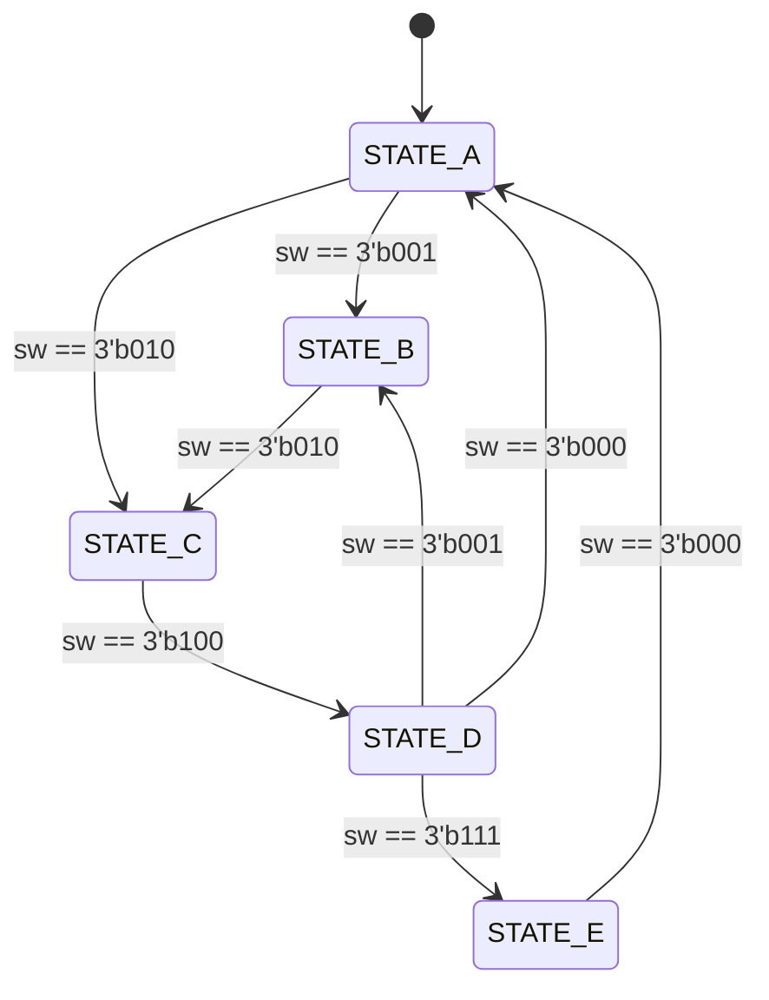

# Day6 FSM State Diagram

검증 시 반드시 확인할 전이 순서는 다음과 같다.

- `A -> B -> C -> D -> E -> A -> C -> D -> A -> C -> D -> B`

추가 확인 조건은 다음과 같다.

- `D -> B` 조건은 `sw == 3'b001`
- 상태 지정이 없는 스위치 입력에서는 현재 상태 hold
- `rst` 입력 시 어느 상태에서든 `STATE_A`로 복귀
